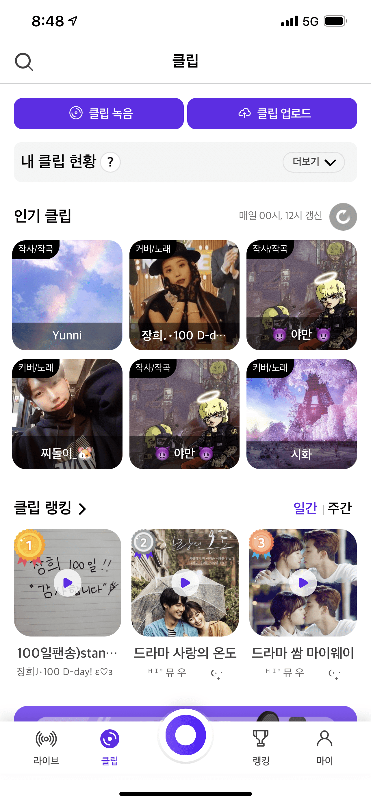
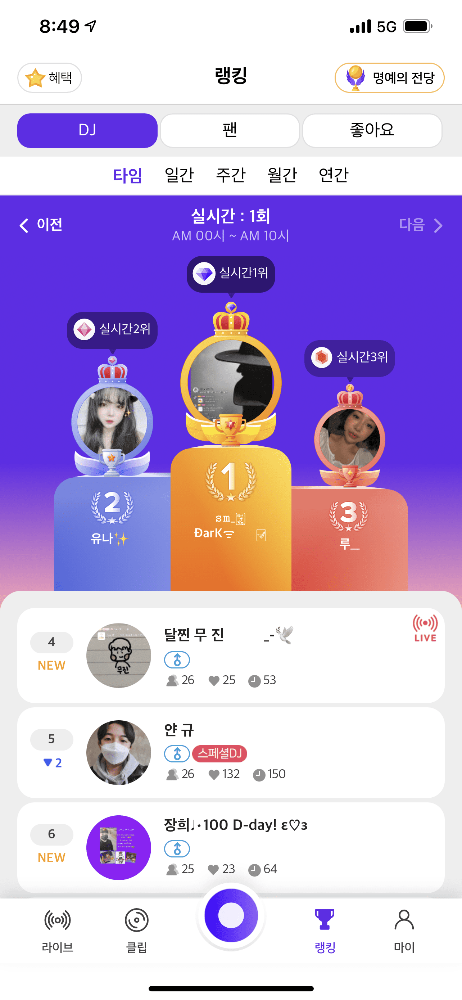

# 인포렉스 ( 2019.11 ~ )

* 달빛라이브 (https://www.dalbitlive.com/)
  + 기간 : 2019.11 ~
  + 달빛라이브 서비스 개발 (https://www.dalbitlive.com/)
     - 개발 언어 : Java8, Spring Boot, node.js, mariaDB
     - 주요 업무
       1. 달빛라이브 관련 이미지 및 파일 서버 구축
       2. 관리자 웹 페이지 및 API 개발
       3. REST 서버 API 개발
       4. 서비스 채팅 서버 운영 및 개발
       5. PUSH 서버 유지보수
       6. 알림톡 발송 기능 개발

    
    
    

    
    
    

# 어다인 ( 2019. 07 ~ 2019. 08 ), ( 2017. 06 ~ 2019. 06 )

* 메시지분배솔루션 ( 자체 솔루션 )

  + 메시지 분배 솔루션 엔진 유지보수 및 신규기능 개발

     - 개발 언어 : Java, freemarker, C, Spring, JSP
     - 주요 업무 
       1. 메시지분배솔루션 유지보수
       2. 메시지분배솔루션 신규 기능 개발 및 테스트
       3. 자사 통합관리 web 페이지 구상 및 개발

    

* SC제일은행 SMS재구축

  + 기간 : 2019.03 ~ 2019.08

  + 메시지 분배 솔루션 고도화

     - 개발 언어 : Linux, freemarker, java
     - 주요 업무 
       1. 메시지분배 솔루션 SMS파트 커스터마이징

    

* IBK기업은행 SMS재구축

  + 기간 : 2018.09 ~ 2019.02

  + 통합 메시징 웹 고도화

     - 개발 언어 : Spring, JSP, Oracle
     - 주요 업무 
       1. 신규 통합 메시징 웹 기획 보조
       2. 신규 통합 메시징 웹 기능 개발
       3. 신규 통합 메시징 웹 기능별 DB 구조 설계 및 쿼리 작성

    

* 삼성카드 MO개인화

  + 기간 : 2018.07 ~ 2018.08

  + MO 캠페인 신규기능 추가 

     - 개발 언어 : Spring, JSP
     - 주요 업무
       1. MO 캠페인 개인화 신규 기능 개발 ( 통합 답변 -> 응답별 답변 개인화 )

    

* 새마을금고 메시징웹 신규기능 개발

  + 기간 : 2018.06 ~ 2018.07

  + 메시징웹 신규기능 개발 

     - 개발 언어 : JSP
     - 주요 업무
       1. 신규 기능 개발

    

* 삼성카드 MO서비스 이중화

  + 기간 : 2017.11 ~ 2018.03

  + 메시징 솔루션 서버 이중화 구축

     - 개발 언어 : Linux, freemarker, java
     - 주요 업무 
       1. 솔루션 서버 이중화 구축 설계 및 구축

    

* 국민은행 요구불 SMS고도화

  + 기간 : 2017.09 ~ 2017.10

  + 메시징 솔루션 고도화

     - 개발 언어 : Linux, freemarker, java
     - 주요 업무
       1. 솔루션 고도화 설계 보조 및 테스트

    

* 현대해상 통합메시징 웹 보안 취약성 패치

  + 기간 : 2017.07 ~ 2017.09
  + 통합메시징 웹 페이지 보안 취약성 패치
     - 개발 언어 : Java, Spring, JSP
     - 주요 업무
       1. 통합메시징 웹 페이지 보안 취약성 관련 수정 개발 

# 메타비즈 ( 2015. 07 ~ 2017. 05 )

* 제약회사 일련번호 관리 솔루션
  + 기간 : 2015년07월 ~ 2017년 05월
  + Java 기반 응용 프로그램
     - 개발 언어 : Java, Swing, Oracle
     - 주요 업무
       1. 공통 UI 및 기능 개발 ( Login, 회원 CRUD, 사용자 히스토리 관리 )
       2. '일련번호 폐기' 기능 담당 개발

